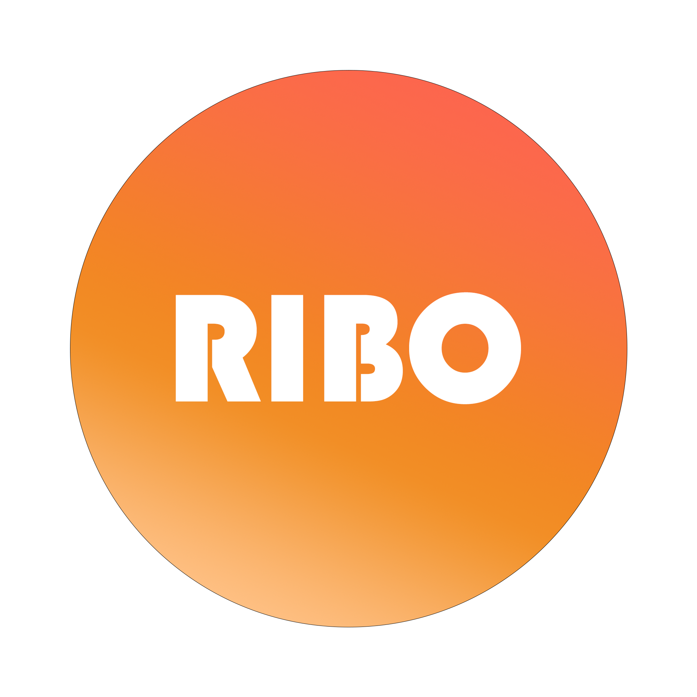

  

##  🤔What is  Ribosome
---

<h4>Ribosome is a Club Manager for Xiamen University Malaysia</h4>

## 

## 什么是Ribosome

Ribosome是一个运行在厦门大学马来西亚分校的社团管理方案

## 关于这个项目

这个项目依赖于Nucleus, 作为一个插件运行于Nucleus. 这是项目的后端部分
